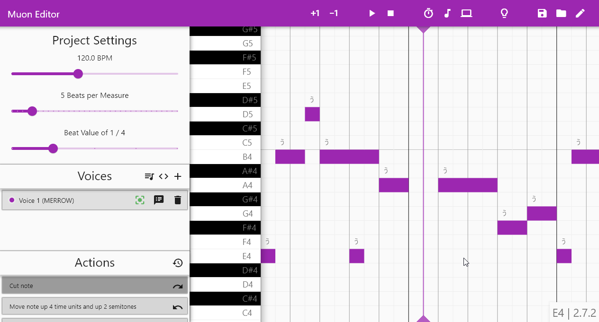

# Muon

A GUI for the [Neutrino neural singing synthesizer](https://n3utrino.work), written in Flutter (and uses [synaps](https://github.com/SwadicalRag/synaps)!).

## Eyecandy / screenshots

### ~~Eye-burning~~ Light mode

### Dark mode

### Features

#### Seamless romaji -> hiragana voice editing

### Multiple voices rendered in parallel

### Automatic voice model listing and on-the-fly changing

### MIDI/MusicXML import

## Usage

Coming soon!

## Changelog

### [08/01/2021] 0.0.3 - Minimum releasable candidate
 - Cleaned up code, abstracted pianoroll to facilitate any future extensions (e.g. f0/mgc editing)
 - Upgraded to use the synaps state management library (and as a result cleaned up more code!)
 - Fixed bugs with note dragging across semitones

### [05/01/2021] 0.0.2 - Proof of concept
 - Cleaned up code, documented many functions and classes
 - Fixed a bug with the flutter_desktop_audio plugin that caused deadlocks

### [04/01/2021] 0.0.1 - Proof of concept
 - Basic functionality implemented

## Building

Building Steps: 
1. Clone this repository somewhere
2. `flutter pub get` -> gets all packages
3. `flutter pub run build_runner build` -> build the generated files for json_serializable/synaps
4. `flutter build windows/macos/linux`
5. *sigh* just read this https://flutter.dev/desktop#distribution

N.B. I have used a fixed version of flutter_desktop_audio which I do not plan on releasing publicly, because I do not wish to maintain that codebase. I will be replacing that module with my own FFI based audio playback library. Until then, if you want to build this yourself, shoot me a message and I can give you source access to my version of flutter_desktop_audio.

## N.B. I am sorry in advance

This is my first Dart/Flutter project, and I am still learning how the Flutter engine works. Though I can figure out how to write logic for a component, I may not know the best way to do it, and I certainly am not familiar with the best practices for Dart and Flutter. The more code I write, the more will learn, and the more my code quality will improve. I am sorry in advance.
